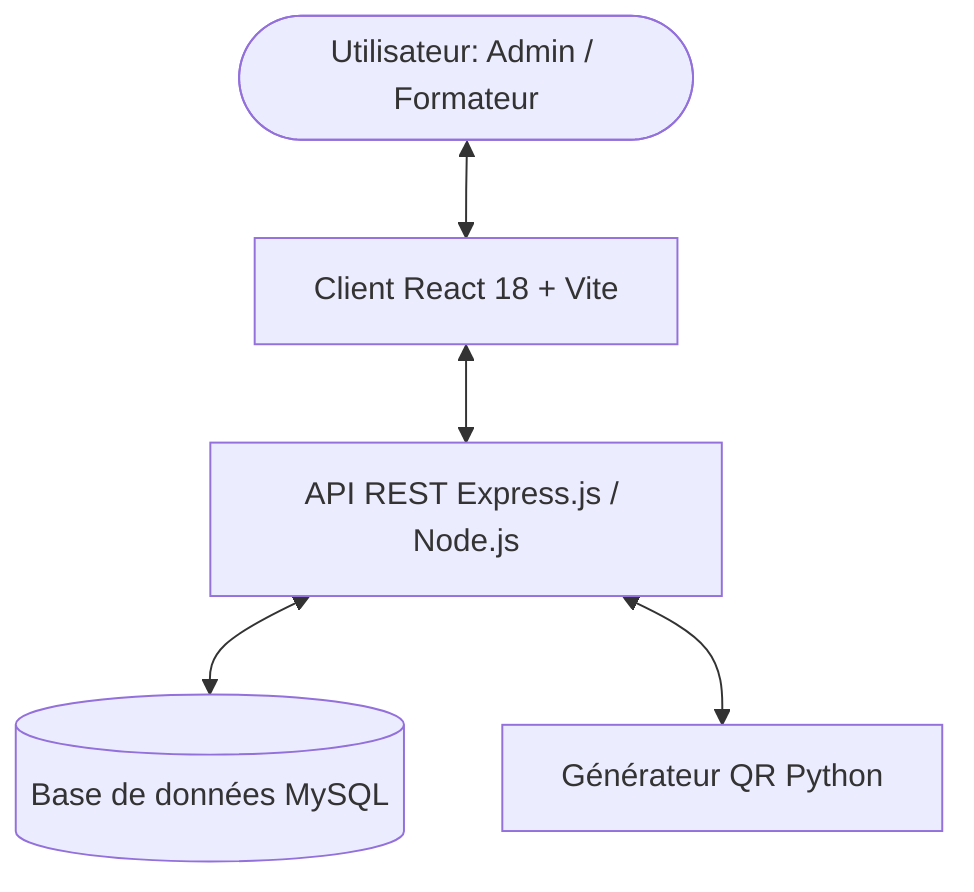

<div align="center">

  

  # 🎓 OFPPT Smart Attendance System
  ### *Système Intelligent de Gestion et Suivi des Absences - ISTA Mirleft*

  [](https://reactjs.org/)
  [](https://nodejs.org/)
  [](https://expressjs.com/)
  [](https://www.mysql.com/)
  [](https://vitejs.dev/)
  [](LICENSE)

  <p align="center">
    Un système web moderne, performant et automatisé de suivi d'assiduité par <b>QR Code</b> conçu pour les établissements de l'<b>OFPPT</b>.
  </p>

  [Fonctionnalités](#-fonctionnalités-clés) •
  [Architecture](#-architecture--stack-technologique) •
  [Installation](#-guide-dinstallation) •
  [L'Équipe](#-contribution-de-léquipe)

</div>

---

## 🌟 Aperçu du Projet

Le **Système Intelligent de Gestion des Absences OFPPT** est une plateforme Web moderne développée pour digitaliser et automatiser le suivi du taux de présence au sein de l'établissement **ISTA Mirleft**. 

En remplaçant la prise de présence traditionnelle sur papier par la **détection QR Code** et des **tableaux de bord analytiques en temps réel**, la solution réduit la charge administrative, prévient la perte de données et offre une visibilité globale instantanée aux formateurs et administrateurs.

---

## ✨ Fonctionnalités Clés

### 👨‍💼 Espace Administration
- 📊 **Tableau de Bord Exécutif :** Vue d'ensemble avec statistiques en temps réel (taux de présence global, évolution hebdomadaire/mensuelle, distribution des présences, tendances).
- 🚨 **Surveillance des Absences Critiques :** Alertes automatiques et détection des récidives pour les stagiaires dépassant le seuil autorisé.
- ⚡ **Barre d'Actions Rapides :** Accès direct à l'ajout de formateurs, gestion des filières, registres et rapports.
- 🏢 **Gestion Stratégique :**
  - **Filières & Salles :** Création, modification et affectation des espaces et formations.
  - **Groupes & Formateurs :** Superviseurs affectés par groupe, effectifs de stagiaires.
  - **Comptes Utilisateurs :** Gestion centralisée avec génération automatique de badges & QR codes.
- 📋 **Registre Centralisé des Absences :** Filtrage avancé (statut, justification, groupe, date), justification en un clic et prise de sanctions disciplinaires.
- 📥 **Export de Rapports :** Exportation des bilans statistiques et registres au format CSV/Excel.

### 👨‍🏫 Espace Formateur
- 📱 **Scanner QR Code en Temps Réel :** Prise de présence instantanée via caméra Web / smartphone.
- 📝 **Saisie et Envoi de Rapports :** Validation de présence par séance, module et groupe.
- 📁 **Dossier de Groupe :** Consultation des profils de stagiaires, historiques d'absences et relevés.
- 🔒 **Mise à jour Obligatoire de Mot de Passe :** Sécurisation renforcée des accès lors de la première connexion.

### 🌐 Ergonomie & Accessibilité
- 🌓 **Mode Sombre / Clair (Dark Mode) :** Persistance automatique du thème préféré.
- 🌐 **Support Multilingue (FR / AR) :** Support natif du Français et de l'Arabe (RTL layout).
- 📱 **Design Modern & Responsive :** Interface fluide adaptée aux écrans desktop, tablettes et mobiles.

---

## 🛠 Architecture & Stack Technologique



### 💻 Technologies Utilisées

| Domaines | Technologies |
|---|---|
| **Frontend** | React 18, Vite, React Router v6, Lucide Icons, Recharts, i18next (FR/AR) |
| **Backend** | Node.js, Express.js, JWT (JSON Web Tokens), bcryptjs |
| **Base de Données** | MySQL / MariaDB (Connection Pool, Transactions SQL) |
| **Outillage QR** | Frontend: `html5-qrcode` \| Backend: Python `generate_qr.py` |
| **Style & UI** | CSS3 (Variables, Glassmorphism, Animations, Dark Mode), Vanilla UI components |

---

## 👥 Contribution de l'Équipe

Ce projet a été conçu et réalisé en équipe dans le cadre de la modernisation des outils de l'établissement :

| Membre | Contributions Majeures |
|---|---|
| 👤 **Mouad** | • Développement des tableaux de données interactifs (`Table Board`)<br>• Module statistiques & chiffres clés (`Numbers Page`)<br>• Système de filtres dynamiques (`Filters Page`)<br>• Interface de gestion des classes & filières |
| 👤 **Bilal** | • Module de gestion des groupes & effectifs (`Group Page`)<br>• Module de génération de rapports (`Report Page`)<br>• Logique métier et UI du registre d'absence (`Registering Absence`)<br>• Pages profil utilisateur et paramètres (`Profile Page`) |
| 👤 **Saif** | • Architecture globale des dashboards d'administration (`Admin Pages`)<br>• Intégration matérielle & logicielle du scanner QR Code (`QR Scanning`)<br>• Structure globale, sécurité des routes et optimisation du projet |

---

## 🚀 Guide d'Installation

### 📋 Prérequis

S'assurer d'avoir installé sur votre machine :
- **Node.js** (v18.0 ou supérieur)
- **MySQL / MariaDB** (via XAMPP, WAMP ou installation autonome)
- **Python 3.x** (pour le module de génération des QR codes)

---

### 1️⃣ Cloner le Dépôt

```bash
git clone https://github.com/mouad-str/OFPPT-SUIVI--ABSENCE.git
cd OFPPT-SUIVI--ABSENCE
```

---

### 2️⃣ Configuration de la Base de Données

1. Lancez votre serveur **MySQL**.
2. Créez une nouvelle base de données nommée `ofppt_attendance`.
3. Importez le fichier SQL de données initiales situé dans `server/ofppt_attendance.sql` ou `server/database.sql` :

```bash
mysql -u root -p ofppt_attendance < server/ofppt_attendance.sql
```

---

### 3️⃣ Configuration des Variables d'Environnement

Créez un fichier `.env` dans le dossier `/server` :

```env
PORT=5000
DB_HOST=localhost
DB_USER=root
DB_PASSWORD=
DB_NAME=ofppt_attendance
JWT_SECRET=ofppt_smart_attendance_secret_key_2026
```

---

### 4️⃣ Installation des Dépendances & Lancement

#### 🖥️ Backend (Serveur)
```bash
cd server
npm install
npm run dev
```
> Le serveur backend démarrera sur **http://localhost:5000**

#### 🌐 Frontend (Client)
Dans un second terminal :
```bash
cd client
npm install
npm run dev
```
> L'application client démarrera sur **http://localhost:5173**

---

## 📁 Structure du Projet

```text
OFPPT-Smart-Attendance/
├── client/                     # Application Frontend React
│   ├── src/
│   │   ├── assets/             # Logos et images
│   │   ├── components/         # Modales, cartes et composants UI
│   │   ├── contexts/           # AuthContext & NotificationContext
│   │   ├── layouts/            # DashboardLayout (Sidebar & Topbar)
│   │   ├── pages/
│   │   │   ├── admin/          # Pages d'administration (Dashboard, Absences, Filière...)
│   │   │   ├── formateur/      # Pages formateur (Groupes, Scanner, Dossiers...)
│   │   │   └── Login/          # Page de connexion
│   │   ├── routes/             # AppRoutes & ProtectedRoute
│   │   └── services/           # Services API Axios (studentService, reportService...)
│   └── vite.config.js
│
├── server/                     # API Backend Node.js / Express
│   ├── config/                 # Connexion Base de Données MySQL Pool
│   ├── controllers/            # Contrôleurs Admin, Formateur & Auth
│   ├── middlewares/            # Authentification JWT & Gestion d'Erreurs
│   ├── routes/                 # Définition des Routes API REST
│   ├── database.sql            # Schéma de base de données
│   └── generate_qr.py          # Script Python de génération QR Code
│
└── README.md                   # Documentation du Projet
```

---

## 🔒 Sécurité & Bonnes Pratiques

- 🔑 **Mots de passe hachés** avec `bcryptjs`.
- 🛡️ **Protection des routes** par rôles (`admin`, `formateur`) avec redirection automatique.
- ⚡ **Interceptor Axios 401 :** Déconnexion et redirection automatique en cas de session expirée.
- 🔄 **Requêtes MySQL paramétrées** prévenant les injections SQL.

---

## 📄 Licence

Ce projet est développé pour les besoins d'automatisation des instituts **OFPPT**.  
Distribué sous la licence **MIT**.

---

<div align="center">
  <sub>Développé avec ❤️ pour l'<b>OFPPT ISTA Mirleft</b></sub>
</div>
